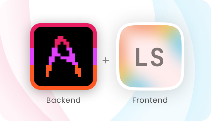
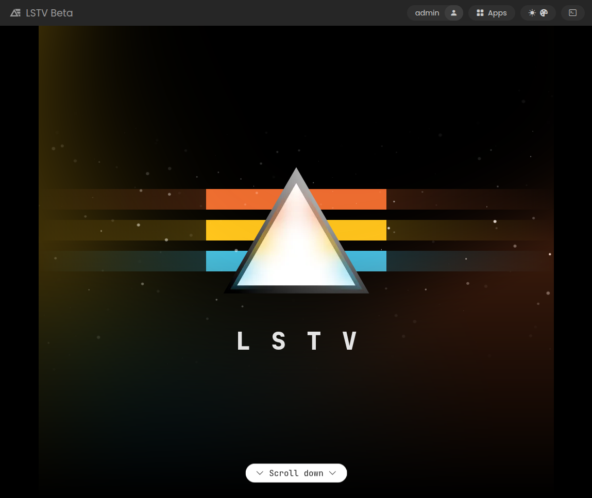

# lstv-web

The [lstv.space](https://lstv.space) website, built with [Akeno](https://github.com/the-lstv/Akeno) as the backend and [LS](https://github.com/the-lstv/ls) as the frontend, both open-source projects developed by me.

Everything is written from scratch by me, no templates, no libraries or dependencies, no AI, no 3rd party code, and only using my own tech stack. *(yap yap nobody cares i know sorry)* 

The website utilizes a hybrid single-page application design, meaning that the initial page loads as usual, and most other pages are simply fetched afterwards and rendered dynamically, without needing a page refresh.

 
 

## 🪄 Features
- Hybrid single-page application design, where the main document is received as usual and other pages are fetched dynamically, for nearly instant loads.
- Responsive design for various screen sizes.
- Secure authentication system with neat features like multi-accounts.
- Authentication on any 3rd party sites via Single Sign-On (SSO), allowing developers to add LSTV account as a login option to their website/app.
- Lightweight and fast reactivity using LS.Reactive.
- All the nice features of the Akeno backend.

## 🛡️ Security
To securely handle authentication, the site uses a contained authentication bridge, which never exposes tokens to the main site. This means that not even the website itself can access tokens, completely preventing any potential XSS attacks. 
The bridge itself has its own security measures to prevent unauthorized access from within. 
The bridge method has its own extra unique advantages - apart from security, it allows *any* authorized site to have secure access, meaning that when the user is logged in on the main site (eg. lstv.space), they will also be logged in on any other site included on the list of trusted origins (eg. extragon.cloud), which is a massive benefit over other methods of authentication. 
Not using cookies also prevents CSRF and gives the bridge proper control over where and when it sends tokens. 
The centralized auth system also allows for a unified API that can implement things like multi-accounts easily. 
All of the website's internal code is isolated and only trusted sources are allowed to interact with it, no global access to sensitive methods is allowed.  

This does not mean that the site is 100% bulletproof - if you are able to find a vulnerability, please report it to me! Maybe you will receive a prize :)

## 🖥️ How to run locally
1. Clone the repository.
2. Install [Akeno](https://github.com/the-lstv/Akeno).
3. Point Akeno to the folder where you cloned the repository (or just place to `/var/www/akeno/`).
4. Start Akeno: `akeno start` or using a PM (eg. `akeno pm2-setup`).
5. Open the website in your browser at http://lstv.localhost.

**Note:** `lstv.localhost` will only work on Linux. If you are on Windows, you will need to either edit your `hosts` file, or configure a different domain/port in `app.conf`.

## 🖥️ How to run offline/without Akeno
You need Akeno to be able to compose the website, but you can bundle it into an offline copy by running `akeno bundle --auto` in the root of the repository.
After that you can run the website from anywhere (well, at least to some extent).

## 🗂️ File structure
- `static/`: Contains site content.
- `assets/`: Contains assets like global css, js, and images.
- `templates/`: Contains templates used by the application.
- `api/`: Not currently included in the repository for security reasons, but it contains the backend and authentication bridge.
- `app.conf`: Akeno app configuration file.

## 📜 License
This project is licensed under the [CC BY-NC-ND 4.0](https://creativecommons.org/licenses/by-nc-nd/4.0/) license.

This project is **not open source** like most of my other projects. 
You are free to browse the code and make contributions, but you are **not allowed** to redistribute modified copies, and you must always include credit when taking code. If you have any questions about what you can take, feel free to contact me. You are not allowed to use this code for commercial purposes. 
You are allowed to run the website for personal or educational use. 
Please consider contributing to the project by reporting issues or suggesting improvements!