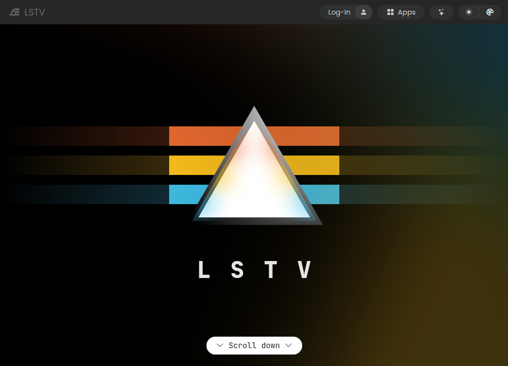

# lstv-web

The [lstv.space](https://lstv.space) website, built with [Akeno](https://github.com/the-lstv/Akeno) as the backend and [LS](https://github.com/the-lstv/ls) as the frontend, both open-source projects developed by me.

Everything is written from scratch by me, no templates, no libraries or dependencies, no AI, no 3rd party code, and only using my own tech stack. *(yap yap nobody cares i know sorry)* 

The website utilizes a hybrid single-page application design, meaning that the initial page loads as usual, and most other pages are simply fetched afterwards and rendered dynamically, without needing a page refresh.

 
 

## 🪄 Features
- Hybrid single-page application design, where the main document is received as usual and other pages are fetched dynamically, for nearly instant loads.
- Responsive design for various screen sizes.
- Secure authentication system with neat features like multi-accounts.
- Authentication on any 3rd party sites via Single Sign-On (SSO), allowing developers to add LSTV account as a login option to their website/app.
- Lightweight and fast reactivity using LS.Reactive.
- All the nice features of the Akeno backend.

## 🛡️ Security
To securely handle authentication, the site uses a contained authentication bridge, which never exposes tokens to the main site. This means that not even the website itself can access tokens, completely preventing any potential XSS attacks. 
The bridge itself has its own security measures to prevent unauthorized access from within. 
The bridge method has its own extra unique advantages - apart from security, it allows *any* authorized site to have secure access, meaning that when the user is logged in on the main site (eg. lstv.space), they will also be logged in on any other site included on the list of trusted origins (eg. extragon.cloud), which is a massive benefit over other methods of authentication. 
Not using cookies also prevents CSRF and gives the bridge proper control over where and when it sends tokens. 
The centralized auth system also allows for a unified API that can implement things like multi-accounts easily. 
All of the website's internal code is isolated and only trusted sources are allowed to interact with it, no global access to sensitive methods is allowed.  

This does not mean that the site is 100% bulletproof - if you are able to find a vulnerability, please report it to me! Maybe you will receive a prize :)

## 🚀 How do we make the site so efficient?
LSTV.space is unique in that it is built from the ground up with the idea that the software should only perform what is necesarry for it's task.
I implement subtle but noticeable optimizations anywhere I can.

This may sound redundant to you - but I believe that all optimizations add up and contribute to a smoother user experience, and smaller load on our servers, which not only reduces costs and allows it to scale way beyond traditional servers, but reduces server latency on it's own.

## 🖥️ How to run locally
1. Clone the repository.
2. Install [Akeno](https://github.com/the-lstv/Akeno).
3. Point Akeno to the folder where you cloned the repository (or just place to `/var/www/akeno/`).
4. Start Akeno: `akeno start` or using a PM (eg. `akeno pm2-setup`).
5. Open the website in your browser at http://lstv.localhost.

To make account features work, you will need to setup the backend as well and run with SSL (HTTPS). 
Note that I provide a way to run the site locally primarily for **development and testing** purposes. I don't welcome public instances being hosted for personal use that aren't for a particular purpose related to LSTV (eg. using it as a base for your own project). Be aware that the website code is not free software (but Akeno and LS is - you can easily make your own site like mine with them, just be original).

## 🖥️ How to run without Akeno or from a static file
You need Akeno (or a significant part of it's preprocessing logic, which can work in isolation, however there is no documented API for that yet) to be able to compose the website, but you can bundle it into an offline copy by running `akeno bundle --auto` in the root of the repository. Note: This is not implemented in the latest Akeno version at this point due to some changes, I will add the API later at some point.
After that you can run the website from almost anywhere, though you won't be able to do a whole lot of testing and the source code will become incompatible and harder to read.

## 🗂️ File structure
- `static/`: Contains actual site content (webserver root), though not exclusively.
- `assets/`: Contains assets like global css, js, and images.
    - `assets/css/`: Contains global CSS files.
    - `assets/js/`: Contains global JavaScript files.
    - `assets/images/`: Contains image assets.
    - `assets/shaders/`: Contains WebGL shader source files.
- `backend/`: Contains the backend (submodule). The source is currently private, but may become public in the future.
- `templates/`: Contains templates used by the application. At this moment this has one `main.html` file, which is the main template used across all pages. Any code here will be available globally.
- `app.conf`: Akeno configuration file. Generic server settings are located here.
- `etc/`: Contains miscellaneous files.

## 📜 License
This project is licensed under the [CC BY-NC-ND 4.0](https://creativecommons.org/licenses/by-nc-nd/4.0/) license.

This project is **not open source** like most of my other projects, it is a personal project. 
You are free to browse the code and make contributions, but you are **not allowed** to redistribute modified copies, in part or as a whole. If you would like permission to take something, feel free to contact me. You are not allowed to use this code for any commercial purposes. 
You are allowed to run the website for personal or educational use. 
Please consider contributing to the project by reporting issues or suggesting improvements!